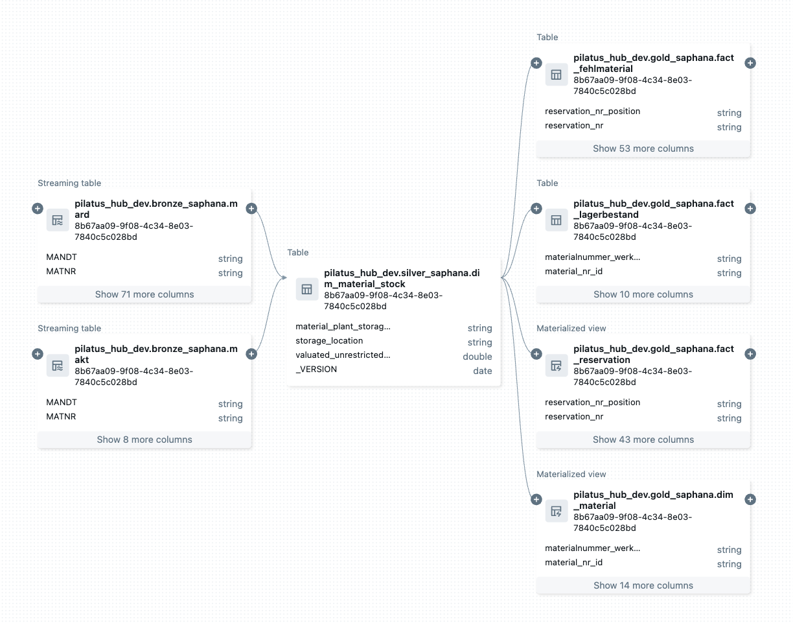
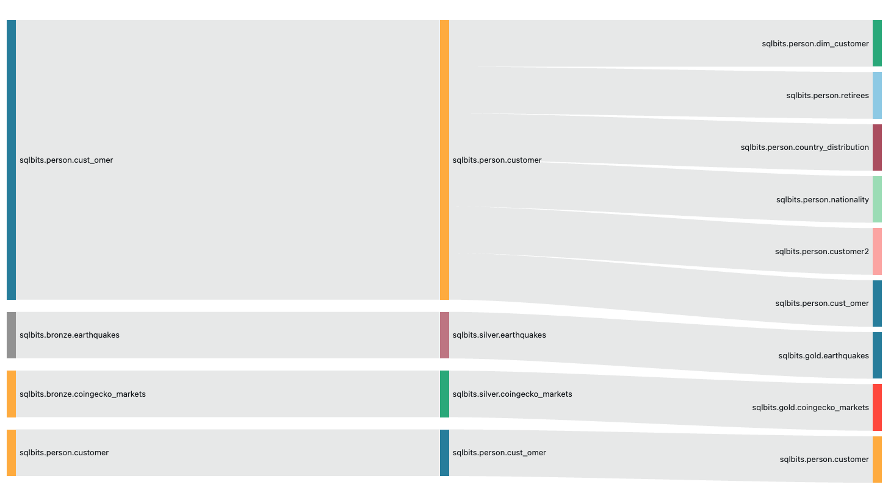

# Table and Column Lineage

## What is Lineage
In the context of data engineering, lineage describes the origin, processing and movement of data within a data ecosystem. It is a form of metadata that shows where data comes from (source), how it was transformed (transformation logic) and where it flows to (target). The aim is to create complete transparency across the life cycle of a data set - from the source to its use in dashboards, reports or machine learning models.

In modern data platforms such as the Databricks Lakehouse architecture, Lineage enables a better understanding of complex data flows across different layers (e.g. Bronze, Silver, Gold). This enables data engineers to
- Identify sources of errors more quickly, such as data discrepancies or pipeline failures,
- assess the effects of schema changes or table drops (‘impact analysis’),
- fulfil compliance requirements by proving how sensitive data has been processed and used,
- and improve the maintainability and governance of the platform.

Lineage can be viewed on different levels:
- Table Lineage: Which tables depend on each other?
- Column lineage: Which columns were transformed and how?
- Job lineage: Which processes or pipelines generate or consume data?

A good lineage system enables visual representations of these relationships, ideally up-to-date and automatically generated - such as through system tables.

## How Lineage Is Created in Databricks
In Databricks, data lineage is automatically captured by the platform when certain operations are performed, particularly within Unity Catalog-enabled workspaces. Lineage information is stored and maintained in system tables, which can be queried for insights into data flow across the Lakehouse.

### 1. Automatic Lineage Capture
Databricks captures lineage metadata automatically when users or processes perform operations such as:
- Creating or updating tables and views with SQL (CREATE TABLE AS SELECT, MERGE, INSERT INTO, etc.)
- Running notebooks or workflows that perform read/write operations on Delta tables
- Executing Delta Live Tables pipelines
- Using Databricks Jobs or Databricks SQL queries

No manual instrumentation is required — as long as Unity Catalog is enabled and the operations are performed on Unity Catalog–managed assets, lineage is tracked.

### 2. Types of Captured Lineage
Databricks provides lineage at multiple granularities:

Table Lineage: Which tables are read from and written to.

Column Lineage: How individual columns flow from source to target, including transformations.

Notebook and Job Lineage: Which notebooks, jobs, or pipelines are responsible for data movement.

### 3. Lineage Storage: System Tables
Lineage metadata is stored in system tables, such as:
- system.access.table_lineage
- system.access.column_lineage

These tables can be queried using SQL to extract lineage information, generate reports, or visualize dependencies.

### 4. Lineage Visualization
Databricks automatically shows lineage in the Unity Catalog UI. When viewing a table or view, you can:

Click on the “Lineage” tab

See upstream and downstream dependencies

Explore the origin and usage of data, both at table and column level

This helps users perform impact analysis, debug pipelines, and improve data governance.

5. Limitations
- Lineage is only captured for Unity Catalog–managed assets
- Not all transformations (e.g., highly dynamic Python logic) result in detailed column-level lineage
- External sources (e.g., data ingested from outside Databricks) may not have lineage unless integrated properly

Further information regarding lineage in Databricks: [https://docs.databricks.com/aws/en/data-governance/unity-catalog/data-lineage](https://docs.databricks.com/aws/en/data-governance/unity-catalog/data-lineage)

## Show Lineage in Databricks Dashboard
The integrated lineage visualisation of Databricks is not always easy to understand and has various limitations. For this reason, we have created a dashboard that extracts the lineage information from the system tables.

The dashboard ‘Table and Column Lineage’ offers 2 different tabs, one for tables and the other for the columns Lineage.

The handling is self-explanatory. Data flow is from left to right. Only lineage information is displayed over 3 stages. If a 4th stage is present, the filter must be adjusted accordingly.